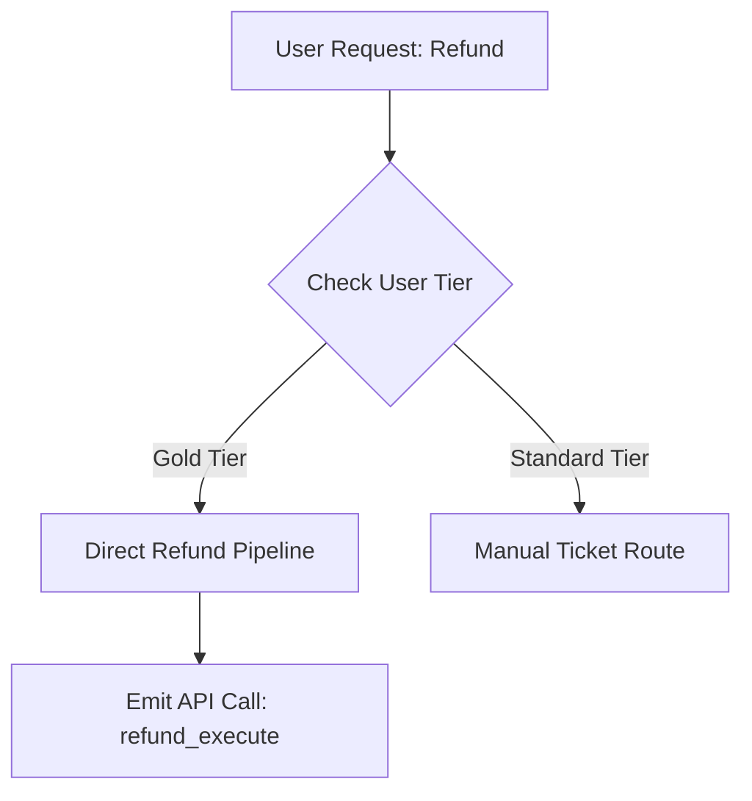

# NEURA-CORE ENGINE
## Extended Technical Design Document & Software Architecture (TDD / GDD)

**Proyecto:** Neura-Core Afectivo  
**Autor:** Alejandro Espinoza (InKing Studio)  
**Estado:** Especificación Técnica de Producción  
**Versión:** 1.0.0-PROD  
**Fecha:** Agosto 2026  
**Dominio:** B2B AI Engines / Gaming / Simulation  

**Distribución del producto:** aplicación de escritorio descargable basada en Tauri. React se usa solo como UI embebida dentro de la ventana nativa; cualquier cliente web, SDK o protocolo descrito aquí es una integración externa y no el producto principal.  

---

## 1. Visión General y Filosofía de Arquitectura

Neura-Core es una plataforma cognitiva desacoplada de alto rendimiento. Abstrae la captura física (mocap, rendering visual, síntesis final de audio) para enfocar recursos en la orquestación afectiva, razonamiento simbólico y memoria jerárquica contextual de alta densidad.

```
+-------------------------------------------------------------------+
|              DESKTOP APPLICATION / CLIENT LAYER                   |
|       (Tauri + React embebido / SDKs / WebSockets)                 |
+-------------------------------------------------------------------+
       ^                                                     |
       | Payload Struct (VAD, AnimTags, Audio)               | Audio/Text Input
       v                                                     v
+-------------------------------------------------------------------+
|                   NEURA-CORE INGESTION GATEWAY                    |
|             (gRPC Streaming / SSE Gateway / NATS Bus)             |
+-------------------------------------------------------------------+
                                 |
                                 v
+-------------------------------------------------------------------+
|                     AFFECTIVE & REASONING ENGINE                  |
|  +---------------------+  +--------------------+  +-------------+ |
|  | VAD Affect Engine   |  | Mermaid Symbolic   |  | LLM Core    | |
|  | Math State Machine  |  | Short Memory       |  | Orchestrator| |
|  +---------------------+  +--------------------+  +-------------+ |
+-------------------------------------------------------------------+
                                 |
                                 v
+-------------------------------------------------------------------+
|             TENCENTDB 4-TIER HIERARCHICAL MEMORY ENGINE            |
|  [L0: Circular Buffer] -> [L1: Vector Index] -> [L2: Graph Store] |
|                             -> [L3: Core Profile]                 |
+-------------------------------------------------------------------+
```

### 1.1 SLAs y Métricas Término a Término
* **Latencia Processing End-to-End:** $< 120\text{ ms}$ (sin LLM stream generation), $< 450\text{ ms}$ (con First Token Generation via SSE).
* **Throughput:** $5000$ concurrent active agent sessions por nodo de orquestación.
* **Consumo Contextual:** Reducción del $78\%$ en footprint de tokens mediante abstracción Mermaid L2 vs. retención flat-history.

---

## 2. Arquitectura de Memoria Jerárquica (TencentDB Model)

Neura-Core implementa un pipeline de memoria estructurado en 4 capas basadas en el modelo de agentes de TencentDB:

```
                  +-----------------------------------+
                  |     L3: Persona & Core Profile    |  Persistente (System Prompt)
                  +-----------------------------------+
                                    ^
                                    | Promoción de Hitos
                  +-----------------------------------+
                  |     L2: Scenario & Context Graph  |  Markdown Relacional
                  +-----------------------------------+
                                    ^
                                    | Agrupación Semántica
                  +-----------------------------------+
                  |       L1: Atomic Fact Index       |  Vector + Metadata Filter
                  +-----------------------------------+
                                    ^
                                    | Extraer Hechos
                  +-----------------------------------+
                  |     L0: Raw Log Circular Buffer   |  RAM / Redis Stream
                  +-----------------------------------+
```

### 2.1 Especificación Detallada por Nivel

#### Nivel L0: Raw Conversation & Event Logs
* **Storage:** Redis Streams con MaxLen limit (`XADD streamMaxLen 200`).
* **Estructura de Registro:**
  ```json
  {
    "entryId": "1785675537000-0",
    "timestamp": 1785675537000,
    "speaker": "user",
    "rawPayload": "Exijo la devolución de mi dinero inmediatamente.",
    "audioProsodyMetrics": {
      "pitchHz": 240.5,
      "energyDb": -12.2,
      "speechRateSyllablesSec": 6.8
    }
  }
  ```
* **Lifecycle:** Expira automáticamente a los 30 minutos de inactividad o se condensa mediante worker asíncrono en L1 al cierre de sesión.

#### Nivel L1: Atomic Facts Index
* **Storage:** Redis Vector Search (HNSW Index) / Qdrant Namespace.
* **Algoritmo de Extracción L0 -> L1:**
  ```
  factCertaintyScore = scoreConfidence * temporalRelevance
  vectorMetadata = {
    factId: uuidV4(),
    valenceWeight: floatRange(-1.0, 1.0),
    certaintyScore: floatRange(0.0, 1.0),
    timestamp: unixTimestamp,
    entityTags: stringArray
  }
  ```
* **Query Vectorial Concurrente:** Cosine similarity filtrado por `certaintyScore > 0.75` y decay exponencial de tiempo:
  $$\text{Relevance}(f) = \cos(\vec{q}, \vec{v}_f) \cdot e^{-\lambda (t_{\text{current}} - t_f)}$$

#### Nivel L2: Scenario & Context Nodes
* **Storage:** Archivos Markdown AST con frontmatter YAML e identificadores relacionales.
* **Estructura Nodal L2:**
  ```markdown
  ---
  nodeId: "SCENARIO_BILLING_DISPUTE_09"
  parentScenario: "ROOT_CUSTOMER_SERVICE"
  status: "ACTIVE"
  linkedFacts: ["FACT_0812", "FACT_0944"]
  ---
  # Context Node: Dispute Resolution
  - User claims billing error on premium package.
  - Agent agreed to review logs.
  - Escalation threshold: 2 failed attempts.
  ```

#### Nivel L3: Persona & Core Profile
* **Storage:** Persistent Document Store (PostgreSQL JSONB / DocumentDB).
* **Inyección Dinámica:** Compilador de contexto compila L3 + estado actual VAD + subsistema L2 activo en una ventana fija $< 800$ tokens en el System Prompt.

---

### 2.2 Memoria Corta Simbólica (Mermaid Canvas System)

Para evitar desbordamiento de contexto en ejecuciones complejas de herramientas (Tool Calls / APIs), Neura-Core convierte secuencias de ejecución en grafos Mermaid simbólicos.



#### Protocolo Drill-Down Query
Cuando ocurre una excepción en la ejecución simbólica:
1. El Agente detecta falla en nodo `C`.
2. Emite orden `DRILL_DOWN_QUERY(nodeId="C", focusWindowMs=5000)`.
3. El motor recupera el segmento L0 exacto indexado por `nodeId` desde el buffer Redis para análisis forense sin cargar el historial conversacional completo.

---

## 3. Motor de Affect System (Matriz Emocional VAD)

El estado emocional evoluciona mediante un espacio vectorial tridimensional continuo $(V, A, D) \in [-1.0, 1.0]^3$.

### 3.1 Formulación Matemática

#### 1. Vector de Estado Emocional:
$$E(t) = \begin{bmatrix} V(t) \\ A(t) \\ D(t) \end{bmatrix}$$

#### 2. Ecuación de Decaimiento Emocional (Hacia Línea Base de Personalidad):
$$E(t + \Delta t) = E_{\text{baseline}} + (E(t) - E_{\text{baseline}}) \cdot e^{-\gamma \Delta t} + \Delta E_{\text{stimulus}}$$

Donde $\gamma$ representa el coeficiente de inercia emocional del personaje y $E_{\text{baseline}}$ es la personalidad base definida en L3.

#### 3. Matriz de Impacto por Estímulo Input:
$$\Delta E_{\text{stimulus}} = \mathbf{W}_{\text{affect}} \cdot S_{\text{input}}$$

$$\mathbf{W}_{\text{affect}} = \begin{bmatrix} 
w_{vv} & w_{va} & w_{vd} \\
w_{av} & w_{aa} & w_{ad} \\
w_{dv} & w_{da} & w_{dd} 
\end{bmatrix}$$

### 3.2 Tabla de Estados Emocionales Target y Mapeo Múltiple

| Estado Target | Valence ($V$) | Arousal ($A$) | Dominance ($D$) | Configuración Voz (Pitch, Rate, SSML) | Interfaz Hex Color |
| :--- | :---: | :---: | :---: | :--- | :--- |
| **Profesional Neutro** | $0.00$ | $0.00$ | $0.00$ | `pitch: 1.00`, `rate: 1.00`, `ssml: neutral` | `#64748B` |
| **Empatía / Apoyo** | $+0.75$ | $+0.20$ | $+0.30$ | `pitch: 1.04`, `rate: 0.98`, `ssml: empathetic` | `#F59E0B` |
| **Frustración / Tensión**| $-0.80$ | $+0.85$ | $+0.50$ | `pitch: 0.92`, `rate: 1.15`, `ssml: assertive` | `#DC2626` |
| **Sumisión / Apología** | $-0.40$ | $-0.30$ | $-0.70$ | `pitch: 0.95`, `rate: 0.90`, `ssml: apologetic` | `#3B82F6` |
| **Entusiasmo / Éxito** | $+0.90$ | $+0.90$ | $+0.60$ | `pitch: 1.10`, `rate: 1.08`, `ssml: excited` | `#10B981` |

---

## 4. Payload Estructurado de Salida (JSON Schema)

### 4.1 Production Schema Definition

```json
{
  "$schema": "http://json-schema.org/draft-07/schema#",
  "title": "NeuraCoreEventPayload",
  "type": "object",
  "required": [
    "agentId",
    "timestamp",
    "conversationId",
    "affectState",
    "memoryTrace",
    "cognitiveOutput",
    "behavioralTriggers"
  ],
  "properties": {
    "agentId": { "type": "string" },
    "timestamp": { "type": "integer" },
    "conversationId": { "type": "string" },
    "affectState": {
      "type": "object",
      "required": ["primaryEmotion", "vadVector", "intensity", "uiHexColor"],
      "properties": {
        "primaryEmotion": { "type": "string" },
        "vadVector": {
          "type": "object",
          "required": ["valence", "arousal", "dominance"],
          "properties": {
            "valence": { "type": "number", "minimum": -1.0, "maximum": 1.0 },
            "arousal": { "type": "number", "minimum": -1.0, "maximum": 1.0 },
            "dominance": { "type": "number", "minimum": -1.0, "maximum": 1.0 }
          }
        },
        "intensity": { "type": "number", "minimum": 0.0, "maximum": 1.0 },
        "uiHexColor": { "type": "string", "pattern": "^#[0-9A-Fa-f]{6}$" }
      }
    },
    "memoryTrace": {
      "type": "object",
      "required": ["activeL2Scenario", "retrievedL1Facts", "memoryDrilldownUsed"],
      "properties": {
        "activeL2Scenario": { "type": "string" },
        "retrievedL1Facts": {
          "type": "array",
          "items": { "type": "string" }
        },
        "memoryDrilldownUsed": { "type": "boolean" }
      }
    },
    "cognitiveOutput": {
      "type": "object",
      "required": ["internalThought", "responseText", "speechSynthesisConfig"],
      "properties": {
        "internalThought": { "type": "string" },
        "responseText": { "type": "string" },
        "speechSynthesisConfig": {
          "type": "object",
          "required": ["pitchModifier", "rateModifier", "ssmlEmotion"],
          "properties": {
            "pitchModifier": { "type": "number" },
            "rateModifier": { "type": "number" },
            "ssmlEmotion": { "type": "string" }
          }
        }
      }
    },
    "behavioralTriggers": {
      "type": "object",
      "required": ["animationTag", "clientEvent"],
      "properties": {
        "animationTag": { "type": "string" },
        "clientEvent": { "type": "string" }
      }
    }
  }
}
```

---

## 5. Especificaciones de API e Interconexión B2B

### 5.1 Protocolo gRPC para Gaming / VR Client Stream (`neuracore.proto`)

```protobuf
syntax = "proto3";

package neuracore.v1;

service NeuraCoreEngineService {
  rpc StreamAgentInteraction (stream InteractionInput) returns (stream InteractionOutput);
}

message InteractionInput {
  string agentId = 1;
  string conversationId = 2;
  int64 timestamp = 3;
  oneof payload {
    string textInput = 4;
    bytes audioChunk = 5;
  }
  map<string, string> situationalContext = 6;
}

message VadVector {
  float valence = 1;
  float arousal = 2;
  float dominance = 3;
}

message AffectState {
  string primaryEmotion = 1;
  VadVector vadVector = 2;
  float intensity = 3;
  string uiHexColor = 4;
}

message BehavioralTriggers {
  string animationTag = 1;
  string clientEvent = 2;
}

message InteractionOutput {
  string agentId = 1;
  int64 timestamp = 2;
  AffectState affectState = 3;
  string responseTextChunk = 4;
  BehavioralTriggers behavioralTriggers = 5;
}
```

---

## 6. Casos de Negocio & Integración B2B Deep Dive

### 6.1 Enterprise Customer Care Simulator
* **Mecanismo de Desescalación / Escalación:** Si el usuario mantiene `arousal > 0.70` y `valence < -0.50` durante más de 3 turnos, el motor fuerza el estado emocional del agente a `SUMISION_APOLOGIA` y gatilla el evento cliente `DISPLAY_SUPERVISOR_MODAL`.
* **Métrica de Desempeño Evaluada:** Cálculo en tiempo real del Delta VAD del usuario para puntuar la capacidad de manejo de crisis del estudiante.

### 6.2 EdTech & Healthcare Diagnostics
* **Consistencia Conversacional L2:** Durante simulaciones médicas o entrevistas clínicas, la comprobación en L2 previene que el agente cambie sus síntomas reportados preliminarmente en L1, manteniendo validez diagnóstica.

### 6.3 Gaming & VR (Unreal Engine 5 / Unity Integration)

#### Unreal Engine 5 C++ Integration Architecture:
```cpp
// UNeuraCoreSubsystem.h
#pragma once

#include "CoreMinimal.h"
#include "Subsystems/GameInstanceSubsystem.h"
#include "NeuraCoreSubsystem.generated.h"

UCLASS()
class NEURACORE_API UNeuraCoreSubsystem : public UGameInstanceSubsystem {
    GENERATED_BODY()

public:
    void SendUserInput(FString AgentId, FString UserMessage);
    
    DECLARE_MULTICAST_DELEGATE_TwoParams(FOnAffectStateUpdated, FVector /* VAD */, FName /* AnimTag */);
    FOnAffectStateUpdated OnAffectStateUpdated;
};
```

* **AnimGraph Binding:** El `FVector` devuelto (Valence -> X, Arousal -> Y, Dominance -> Z) se inyecta directamente a la tabla de Blend Spaces en el Animation Blueprint sin procesamiento intermediario.

---

## 7. Plan de Implementación Tecnológica & Roadmap de Producción

| Fase | Hito Principal | Entregables Técnicos | Duración |
| :--- | :--- | :--- | :--- |
| **Fase 1 (M1-M2)** | Core Memory Infrastructure | SDK Redis L0-L1, Parser Markdown L2 Graph, Storage L3 Engine. | 8 Semanas |
| **Fase 2 (M3-M4)** | Affect System & Streaming | Microservicio Go/Rust VAD Engine, Endpoints SSE/gRPC, JSON Validator. | 8 Semanas |
| **Fase 3 (M5-M6)** | Client SDKs & Analytics | Plugin UE5 (C++), Plugin Unity (C#), Web Analytics Dashboard. | 8 Semanas |

---

## 8. Seguridad, Multi-Tenancy y Sanitización de Datos

1. **Aislamiento Multi-Tenant:** Cada cliente B2B opera en un Namespace aislado de Redis/Qdrant con claves dinámicas `tenantId:agentId:conversationId`.
2. **Sanitización PII en L0:** Antes de condensar L0 en L1/L2, se ejecuta un modelo Regex/NER de baja latencia para enmascarar tarjetas de crédito, DNI, emails y números telefónicos.
3. **Failover Protocol:** Si el servicio VAD experimenta una desconexión, el sistema conmuta a un pipeline estático determinista que entrega respuestas en estado `Profesional Neutro` sin degradar la disponibilidad operativa.
