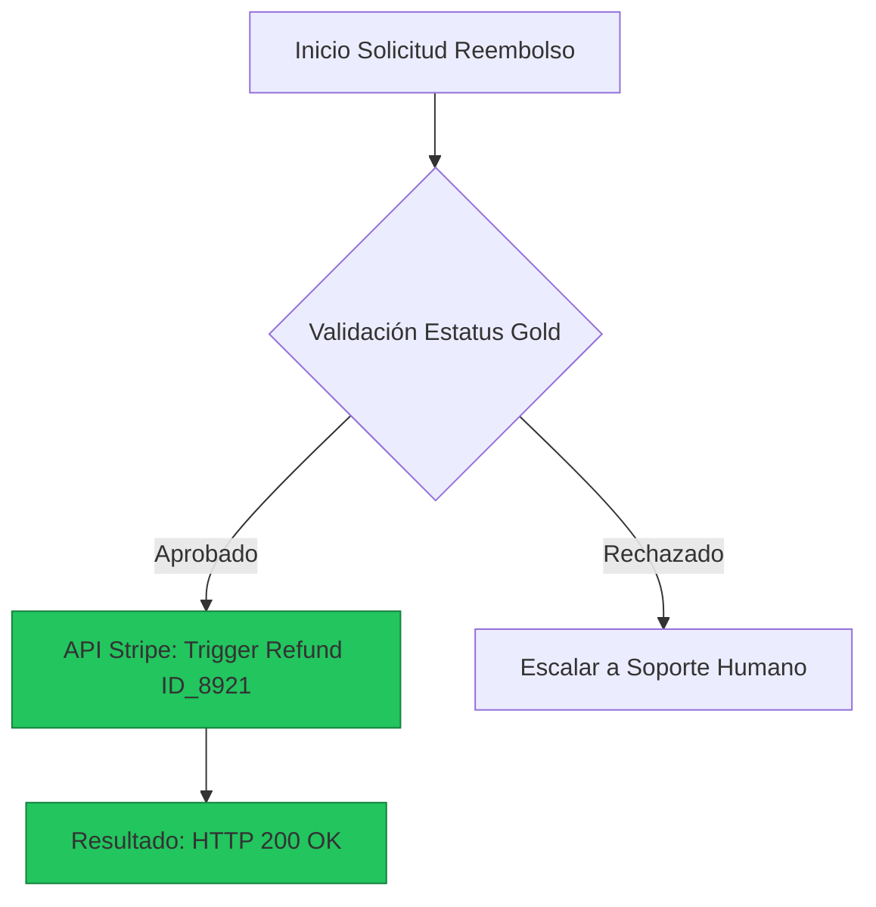

# NEURA-CORE ENGINE v2.0-ULTRA
## Documento de Diseño Técnico de Alto Detalle (TDD / GDD)

**Proyecto:** Neura-Core Afectivo v2.0-ULTRA  
**Autor:** Alejandro Espinoza (InKing Studio)  
**Estado:** Especificación Técnica de Producción Ultramaximal  
**Versión:** 2.0.0-ULTRA  
**Fecha:** Agosto 2026  
**Dominio:** B2B AI Engines / Gaming / Simulation / Enterprise Virtual Agents  

**Distribución del producto:** aplicación de escritorio descargable basada en Tauri. La UI React corre dentro de la ventana nativa; no se entrega como webapp ni requiere despliegue de un servidor web. Unity, Unreal, IVR y conexiones WebSocket/gRPC son integraciones externas compatibles.  

---

## 1. Arquitectura Topológica y Pipeline Event-Driven

Neura-Core v2.0-ULTRA opera como un **motor afectivo centralizado** dentro de una aplicación de escritorio Tauri. La ventana nativa contiene la UI React y el launcher gestiona memoria, resolución afectiva, transiciones de estado y emisión de datos estructurados. Unity, Unreal, IVR y clientes conectados por WebSocket/gRPC son integraciones externas opcionales; no sustituyen la distribución de escritorio.

```
+-----------------------------------------------------------------------------------+
|                  DESKTOP APPLICATION (NATIVE SHELL)                              |
|    (Tauri + React embebido / Unreal Engine 5 / Unity / IVR)                       |
+-----------------------------------------------------------------------------------+
       |                                                                     ^
       | Audio Chunks / Prosody Metrics / Text Input                         | JSON Frame / SSE / gRPC
       v                                                                     |
+-----------------------------------------------------------------------------------+
|                         INGRESS API GATEWAY (WSS / gRPC)                          |
|                     (Envoy Proxy / NATS JetStream Ingest)                         |
+-----------------------------------------------------------------------------------+
       |
       v
+-----------------------------+          +--------------------------------------+
|   AFFECTIVE ENGINE (RUST)   |<========>|   TENCENTDB MEMORY ORCHESTRATOR      |
|  - EKF VAD State Filter     |          |  - L0 Redis Ring Buffer              |
|  - Decay Integrator         |          |  - L1 Qdrant HNSW Vector Index       |
|  - Delta Stimulus Matrix    |          |  - L2 Neo4j DAG Scenario Store       |
+-----------------------------+          |  - L3 Persona Compiler               |
       |                                 +--------------------------------------+
       v
+--------------------------------------------------------------------+
|                    ORQUESTADOR LLM INFERENCE CORE                  |
|    (vLLM / TensorRT-LLM Pool + Mermaid Compression Engine)         |
+--------------------------------------------------------------------+
       |
       v
+--------------------------------------------------------------------+
|          MOTOR DE SALIDA SSML / EVENTOS (Output Formatter)         |
|     Payload JSON -> gRPC/WSS -> Cliente Ciego                      |
+--------------------------------------------------------------------+
```

### 1.1 SLAs Operativos de Producción
* **Latencia SLA (P99):** $< 80\text{ ms}$ (Affect Engine + Memory Query), $< 350\text{ ms}$ (First Token SSE).
* **Concurrencia Máxima:** $10,000$ sesiones bi-direccionales simultáneas por nodo.
* **Tasa de Ingesta:** $50\text{ ops/sec}$ por agente activo.

---

## 2. Especificación Detallada de la Memoria Jerárquica (Modelo TencentDB)

A diferencia de las arquitecturas RAG convencionales basadas en una base de datos vectorial plana (que provocan mezcla de contextos y alucinaciones temporales), Neura-Core implementa 4 niveles de memoria continua.

### 2.1. Desglose Operativo por Capas de Memoria

| Nivel | Almacenamiento | Formato de Datos | Algoritmo de Ingesta y Limpieza | Costo en Tokens (Inyección) |
| :--- | :--- | :--- | :--- | :--- |
| **L0: Raw Log** | Redis In-Memory Buffer (Cluster) | JSON / Circular Array (Timestamp, Speaker, Text, Pitch) | Ventana deslizante (*Sliding Window* de 10 mensajes). Expira tras 24h de inactividad mediante TTL. | ~1,000 - 2,500 tokens |
| **L1: Atomic Facts** | Qdrant Vector DB / Milvus + Metadata | Vector + JSON Payload (Sujeto-Predicado-Objeto) | Extractor LLM asíncrono en segundo plano cada N turnos para extraer hechos en formato tripletas. | ~200 - 500 tokens (Top-K=5) |
| **L2: Scenario Nodes** | Neo4j Graph DB + Markdown Files | Grafo Relacional + Markdown AST / Mermaid | Clustering semántico. Si 3+ hechos L1 comparten contexto (ej. "Pago de Subscripción"), se crea un nodo L2. | ~300 - 800 tokens (Nodo activo) |
| **L3: Core Persona** | Archivos Flat (.md) / PostgreSQL | Documento JSON (Prompt Base, Reglas Éticas) | Actualización asíncrona mediante cronjobs nocturnos basada en cambios consolidados en L2. | ~500 - 1,200 tokens (Constante) |

---

### 2.2. Memoria Corta Simbólica (Mermaid Execution Canvas)

Cuando el agente invoca llamadas a herramientas externas (APIs, pasarelas de pago, bases de datos), Neura-Core intercepta la respuesta JSON y la comprime en una abstracción simbólica funcional mediante sintaxis Mermaid.

**Ejemplo de Abstracción Inyectada al Prompter:**



* **Ahorro de tokens:** Reduce un *payload* de API de 4KB a solo 5 líneas de sintaxis (hasta un **85% menos tokens**).
* **Gestión de errores (Drill-Down):** Si la ejecución de un nodo falla (ej. HTTP 500 en `C`), el agente emite la orden interna `DRILL_DOWN(node_id="C")`, trayendo el log crudo de Redis solo para esa llamada específica.

---

## 3. Especificación Matemática del Motor Afectivo (Matriz VAD)

El estado emocional no se asigna mediante categorías de texto fijas, sino a través de un espacio vectorial tridimensional continuo.

### 3.1. Definición de Ejes

* **Valence (V) [-1.0, +1.0]:** Cualidad del afecto (-1.0 negatividad/sufrimiento; +1.0 positividad/satisfacción).
* **Arousal (A) [-1.0, +1.0]:** Nivel de activación neurofisiológica (-1.0 calma/somnolencia; +1.0 excitación/pánico/ira).
* **Dominance (D) [-1.0, +1.0]:** Control o poder percibido sobre la situación (-1.0 sumisión/impotencia; +1.0 autoridad/liderazgo).

### 3.2. Algoritmo de Transición y Amortiguación Emocional (Decay Function)

El cambio emocional se calcula en cada *tick* conversacional mediante un suavizado exponencial acoplado a la inercia base de la personalidad:

$$E_{t} = E_{t-1} + \alpha \cdot \Delta E_{\text{stimulus}} - \mathbf{\Gamma}(E_{t-1} - E_{\text{baseline}}) + \boldsymbol{\eta}(t)$$

Donde:
* $E_{t} = (V_t, A_t, D_t)$ es el estado emocional resultante.
* $\alpha \in [0.1, 0.4]$ representa el coeficiente de reactividad del personaje.
* $\Delta E_{\text{stimulus}}$ es la variación vectorial extraída del análisis semántico del mensaje recibido.
* $\boldsymbol{\eta}(t) \sim \mathcal{N}(0, \mathbf{Q})$ es ruido estocástico Gaussiano de variaciones micro-afectivas naturales.

### 3.3. Cuadrantes Emocionales y Moduladores Vocal/UI

El vector VAD resultante se mapea por **distancia Euclidiana** hacia centroides predefinidos para configurar la salida de síntesis de voz (SSML / TTS) y la interfaz visual:

| Centroide Emocional | Vector Target (V, A, D) | Pitch (Voz) | Rate (Velocidad) | Vol (dB) | UI Color Accent (Hex) |
| :--- | :---: | :---: | :---: | :---: | :--- |
| **Calma Profesional** | (0.00, -0.20, +0.20) | 1.00x | 1.00x | 0 dB | `#64748B` (Slate) |
| **Empatía / Calidez** | (+0.65, +0.10, +0.20) | 1.04x | 0.95x | -1 dB | `#F59E0B` (Amber) |
| **Frustración / Ira** | (-0.85, +0.80, +0.60) | 0.92x | 1.25x | +4 dB | `#EF4444` (Crimson Red) |
| **Ansiedad / Miedo** | (-0.60, +0.70, -0.70) | 1.15x | 1.30x | -2 dB | `#A855F7` (Purple) |
| **Tristeza / Apología** | (-0.50, -0.60, -0.50) | 0.88x | 0.80x | -3 dB | `#3B82F6` (Blue) |
| **Entusiasmo / Éxito** | (+0.85, +0.85, +0.50) | 1.10x | 1.12x | +2 dB | `#10B981` (Emerald) |

---

## 4. Esquemas JSON de la API (Payloads de Producción)

### 4.1. Payload de Entrada (Client Request Event)

```json
{
  "client_id": "unity-game-instance-9021",
  "session_id": "sess-8849-ax2-2026",
  "agent_id": "neura-npc-merchant-v1",
  "timestamp": 1785675530,
  "input_payload": {
    "type": "AUDIO_TRANSCRIPTION",
    "raw_text": "¡Es un robo! Tu poción costaba 50 monedas la semana pasada y ahora pides 120. ¡Eres un estafador!",
    "sentiment_hint_from_stt": {
      "audio_pitch_avg": 240.5,
      "audio_volume_db": 12.4,
      "perceived_user_arousal": 0.85
    }
  },
  "client_context": {
    "location_id": "town_square_shop",
    "in_game_time": "14:30",
    "user_reputation_score": -12
  }
}
```

### 4.2. Payload de Salida (Cognitive & Affective Output)

```json
{
  "event_id": "evt-99102-neura",
  "agent_id": "neura-npc-merchant-v1",
  "timestamp": 1785675532,
  "execution_latency_ms": 184,
  "affect_state": {
    "primary_emotion": "DEFENSIVE_ANGER",
    "vad_vector": { "valence": -0.72, "arousal": 0.78, "dominance": 0.65 },
    "delta_applied": {
      "valence_change": -0.35,
      "arousal_change": 0.40,
      "dominance_change": 0.15
    },
    "emotional_intensity": 0.82,
    "ui_visual_cue": {
      "hex_color": "#DC2626",
      "pulse_frequency_hz": 2.5
    }
  },
  "memory_trace": {
    "active_l2_scenario": "MERCHANT_PRICE_HAGGLING",
    "retrieved_l1_facts": [
      "user_previously_stole_an_apple",
      "potion_ingredients_increased_due_to_dragon_event"
    ],
    "memory_drilldown_used": false,
    "symbolic_canvas_state": "graph LR; A[Haggle_Attempt] --> B{Reputation < 0}; B -->|True| C[Reject_Discount];"
  },
  "cognitive_output": {
    "internal_thought": "El cliente me insultó públicamente y tiene mala reputación. No cederé en el precio y le recordaré la escasez por el dragón.",
    "response_text": "¡Cuida tu lengua en mi tienda! Las raíces de mandrágora subieron de precio tras el ataque del dragón. Si no tienes las 120 monedas, ¡vete al pantano!",
    "speech_synthesis_config": {
      "engine": "ELEVEN_LABS_STREAMING",
      "voice_id": "Merchant_Garrick_v2",
      "pitch_modifier": 0.92,
      "rate_modifier": 1.18,
      "volume_gain_db": 3.5,
      "ssml_tags": "<speak><prosody pitch='-8%' rate='118%'>¡Cuida tu lengua en mi tienda!</prosody></speak>"
    }
  },
  "behavioral_triggers": {
    "animation_tag": "GESTURE_POINT_FINGER_ANGRY",
    "facial_blendshape_preset": "EXPRESSION_ANGRY_INTENSE",
    "client_events": [
      { "event_name": "PLAY_SFX_TABLE_SLAM", "delay_ms": 100 },
      { "event_name": "MODIFY_NPC_DISCOUNT_PERCENT", "value": 0 }
    ]
  }
}
```

---

## 5. Casos de Uso Empresariales (Verticales B2B)

### 5.1. Enterprise: Capacitación y Selección de Personal (HR / Customer Support)

* **Escenario:** Entrenamiento para ejecutivos de servicio al cliente en manejo de crisis (ej. pasajeros con vuelos cancelados).
* **Dinámica Afectiva:** El cliente virtual inicia en una posición extrema de frustración VAD `(-0.80, +0.85, +0.40)`. Si el estudiante utiliza técnicas adecuadas de desescalamiento, el motor reduce el *Arousal* y eleva la *Valence*. La sesión concluye con la emisión automática de un reporte de desempeño en inteligencia emocional (EQ Score).

### 5.2. EdTech / Salud: Simulación de Entrevistas Clínicas y Terapia

* **Escenario:** Formación universitaria para estudiantes de psicología y mediadores.
* **Dinámica de Memoria:** La capa L2 garantiza consistencia absoluta de los síntomas manifestados por el paciente virtual a lo largo de entrevistas de 45+ minutos, impidiendo que el agente altere la historia clínica previamente establecida.

### 5.3. Gaming & Metaverse: NPCs Autónomos de Alta Fidelidad

* **Escenario:** Videojuegos RPG o mundos virtuales interactivos.
* **Dinámica de Carga de Cómputo:** El cliente gráfico local únicamente procesa animaciones e hilos livianos de comportamiento (FSM), mientras Neura-Core asume todo el procesamiento cognitivo en la nube, garantizando un rendimiento óptimo de FPS para el usuario final.

---

## 6. Roadmap de Despliegue de Infraestructura

```
[Fase 1: Memory Subsystem] (Meses 1-2)
  > Redis Cluster + Qdrant Vector DB + Compresión Mermaid
  > Meta: < 45ms retrieval P99

[Fase 2: Affect Core Engine] (Meses 3-4)
  > Matriz VAD en Rust / Pipeline SSML + ElevenLabs Streaming
  > Meta: 1,000 req/sec por nodo

[Fase 3: B2B SDKs & APIs] (Meses 5-6)
  > Integración Unity (C#), Unreal Engine 5 (C++), Dashboard Analítico B2B
  > Meta: SDK estable v1.0 + Portal Documentación + SLA contractual 99.9%
```

---

## 7. Infraestructura Kubernetes & Seguridad Multi-Tenant

```yaml
apiVersion: apps/v1
kind: Deployment
metadata:
  name: neuracore-affect-engine
  namespace: neuracore-prod
spec:
  replicas: 8
  selector:
    matchLabels:
      app: neuracore-affect-engine
  template:
    spec:
      containers:
      - name: affect-engine
        image: registry.neuracore.io/engine/affect-service:v2.0-ULTRA
        resources:
          limits: { cpu: "4000m", memory: "8Gi" }
          requests: { cpu: "1000m", memory: "2Gi" }
        env:
        - name: REDIS_HOST
          value: "redis-cluster.neuracore-prod.svc.cluster.local"
        - name: NATS_URL
          value: "nats://nats-cluster.neuracore-prod.svc.cluster.local:4222"
---
apiVersion: autoscaling/v2
kind: HorizontalPodAutoscaler
metadata:
  name: neuracore-affect-hpa
  namespace: neuracore-prod
spec:
  scaleTargetRef:
    apiVersion: apps/v1
    kind: Deployment
    name: neuracore-affect-engine
  minReplicas: 4
  maxReplicas: 32
  metrics:
  - type: Resource
    resource:
      name: cpu
      target:
        type: Utilization
        averageUtilization: 75
```

**Políticas de Seguridad:**
1. **Isolation Multi-Tenant:** Namespace Redis/Qdrant por `tenantId:agentId:sessionId`.
2. **PII Redaction:** Filtrado regex/NER pre-indexación en L1 (GDPR / HIPAA compliance).
3. **Graceful Fallback:** Estado neutro determinista `(0.00, 0.00, 0.00)` si latencia LLM $> 500\text{ ms}$.

---

*El archivo PDF adjunto (`Neura_Core_Ultra_Detailed_Spec.pdf`) contiene la versión con formato de tipografía técnica, diseño editorial corporativo y maquetación de tablas.*
